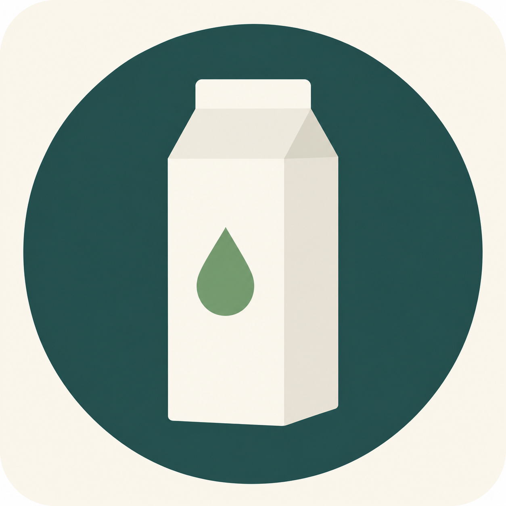
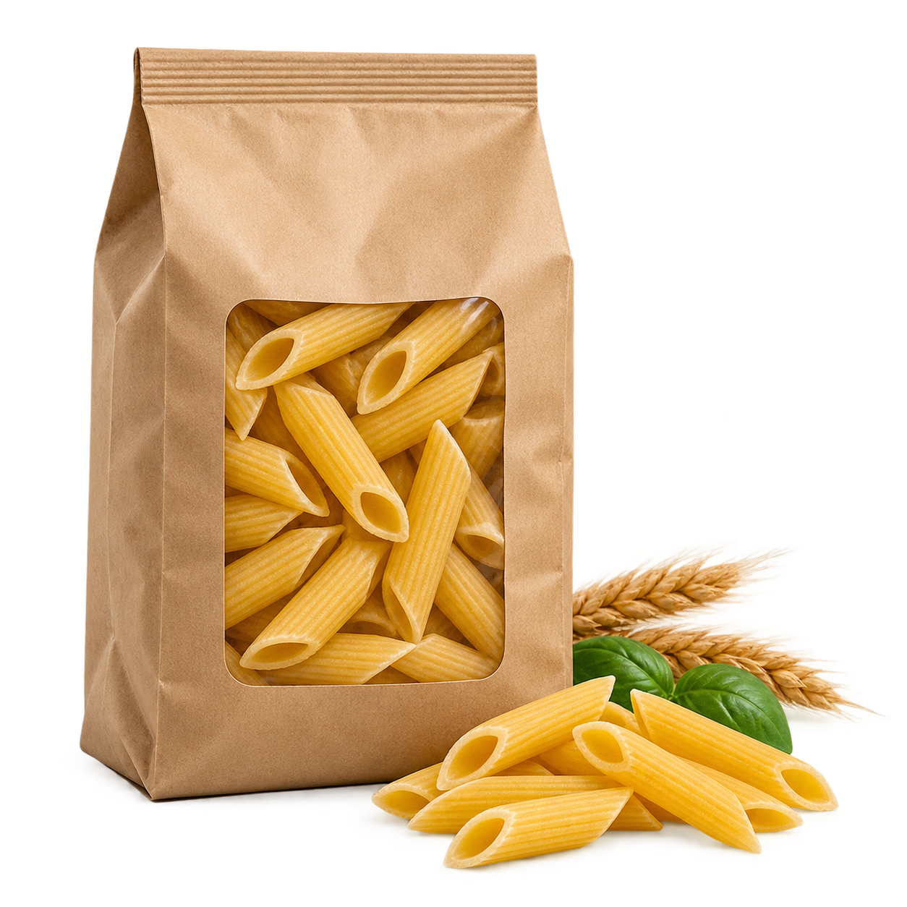
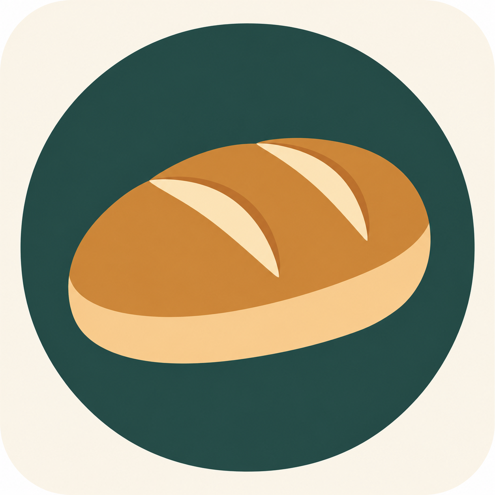
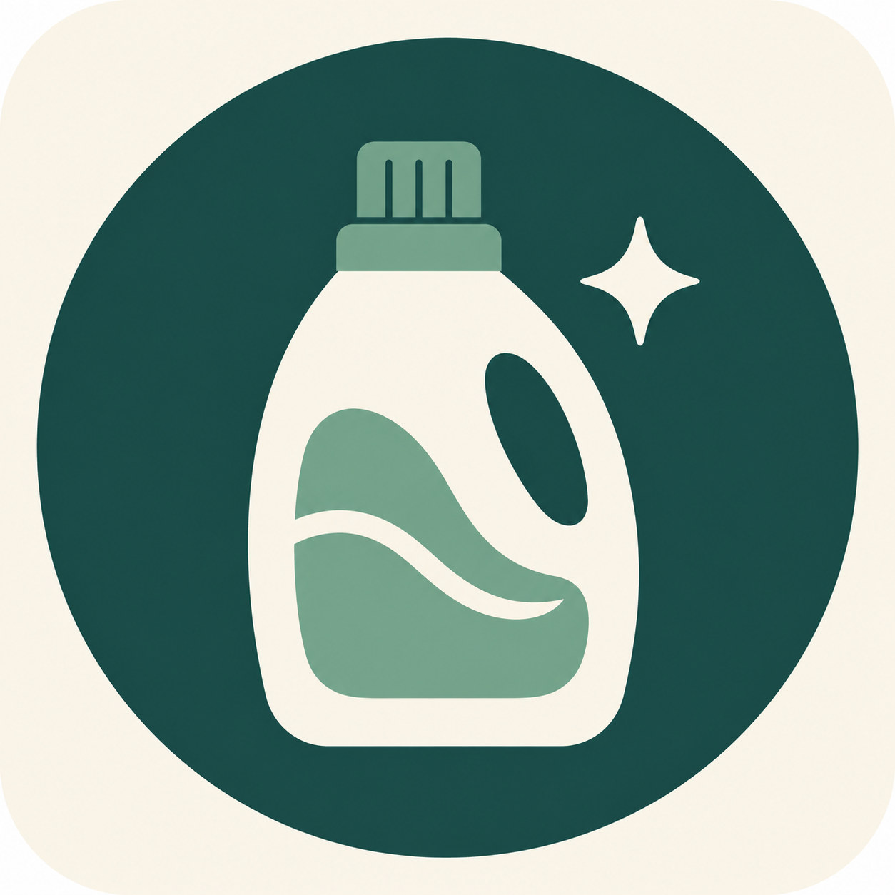
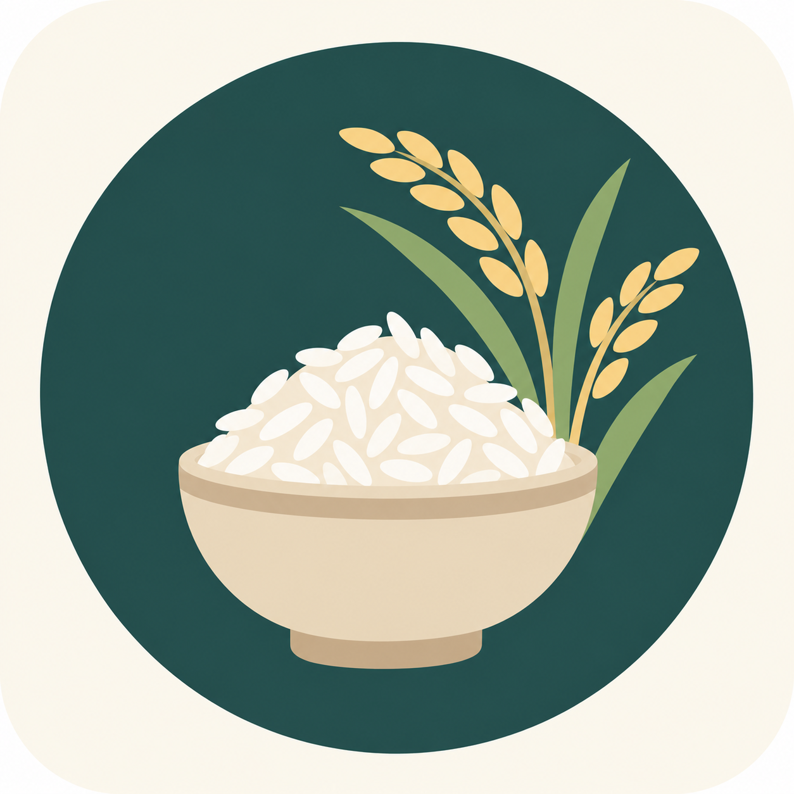
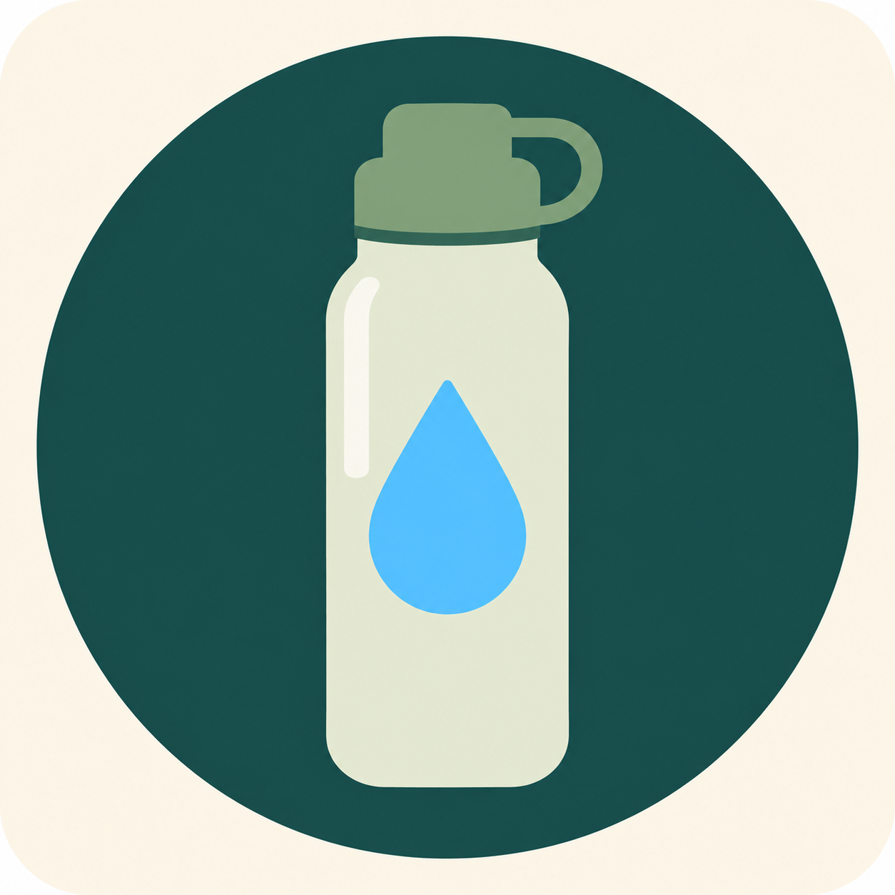

# ShopEasily

  

  <strong>Risparmio intelligente, qualità e sostenibilità in un'unica spesa.</strong>

Prototipo Android nativo in Kotlin e Jetpack Compose per confrontare la spesa per prezzo, distanza, qualità e sostenibilità.

## Identità visiva

Il simbolo combina una **E** geometrica con una foglia. La E richiama il nome ShopEasily, mentre la foglia rappresenta prodotti freschi, attenzione ambientale e scelte di consumo responsabili. Il verde scuro comunica affidabilità e il verde brillante evidenzia la componente sostenibile.

### Immagini prodotto

Gli asset sono icone originali, minimali e prive di marchi commerciali. Forme e colori sono coerenti in tutte le categorie e restano leggibili anche nelle card più compatte.

<table>
  <tr>
    <th>Latte</th>
    <th>Pasta</th>
    <th>Ortofrutta</th>
  </tr>
  <tr>
    <td align="center"></td>
    <td align="center"></td>
    <td align="center"></td>
  </tr>
  <tr>
    <th>Carne</th>
    <th>Forno</th>
    <th>Casa</th>
  </tr>
  <tr>
    <td align="center"></td>
    <td align="center"></td>
    <td align="center"></td>
  </tr>
  <tr><th>Pesce</th><th>Riso</th><th>Legumi</th></tr>
  <tr>
    <td align="center"></td>
    <td align="center"></td>
    <td align="center"></td>
  </tr>
  <tr><th>Uova</th><th>Formaggio</th><th>Yogurt</th></tr>
  <tr>
    <td align="center"></td>
    <td align="center"></td>
    <td align="center"></td>
  </tr>
  <tr><th>Caffè</th><th>Acqua</th><th>Olio</th></tr>
  <tr>
    <td align="center"></td>
    <td align="center"></td>
    <td align="center"></td>
  </tr>
</table>

## Avvio

1. Apri il progetto con Android Studio.
2. Esegui **Sync Project with Gradle Files**.
3. Avvia l'app su un dispositivo o emulatore con accesso a Internet.

Non serve alcun server. Quando la mappa ottiene la posizione, l'app interroga direttamente OpenStreetMap/Overpass, scopre i negozi nel raggio scelto, visita i siti pubblici consentiti, legge JSON-LD e volantini PDF testuali e conserva fino a 10.000 offerte nella memoria privata del telefono. Il catalogo dimostrativo resta disponibile durante la prima sincronizzazione o senza rete.

La mappa usa **MapLibre e OpenStreetMap** e non richiede chiavi API. La configurazione attuale dei tile pubblici è adatta allo sviluppo; prima della pubblicazione va scelto un provider con capacità e condizioni adeguate oppure un servizio ospitato direttamente.

## Raccolta dati autonoma

La raccolta usata dall'app avviene direttamente sul dispositivo:

- trova supermercati, discount, mercati e piccoli negozi da OpenStreetMap/Overpass nel raggio scelto;
- verifica `robots.txt`, identifica l'app e limita numero e dimensione dei documenti;
- importa dati prodotto JSON-LD e PDF testuali pubblicamente accessibili;
- conserva automaticamente fino a 10.000 offerte per funzionare anche offline;
- aggiorna i prezzi medi di benzina, diesel e GPL dai dati aperti MIMIT.

La cartella `backend/` rimane esclusivamente come strumento opzionale di sviluppo e non serve per installare o usare l'app.

Le app dei retailer e le recensioni di Google Maps/Tripadvisor vanno acquisite solo tramite API ufficiali e relative licenze: non vengono aggirati login, CAPTCHA o divieti di scraping. Tripadvisor richiede inoltre attribuzione per i dati della Content API.

## Funzioni presenti

- ricerca e ranking di offerte attive nel giorno corrente;
- scoperta automatica geografica di cataloghi pubblici, sitemap, JSON-LD e volantini PDF;
- immagini prodotto e indicatori di qualità/sostenibilità;
- badge prodotto solo-icon con descrizioni accessibili a TalkBack;
- illustrazioni minimali per categoria; immagini ufficiali del negozio solo quando il feed ne concede esplicitamente il riuso;
- immagine specifica del prodotto dal catalogo pubblico quando disponibile, con fallback locale per categoria;
- filtro per insegna, favicon/marchio dello store e totale stimato degli articoli ancora da acquistare;
- filtro per distanza, carta fedeltà ed età minima;
- profilo con carte fedeltà possedute: un'offerta riservata viene mostrata solo per la catena registrata;
- mappa operativa con posizione, nomi reali OpenStreetMap, distanza, selezione rapida e indicazioni stradali;
- foglia verde solo per punti vendita con tag pubblici bio, filiera locale o fair-trade;
- lista della spesa persistente;
- confronto del carrello, compresi prezzi non promozionali;
- confronto tra punti vendita fisici e servizi online;
- stima di carburante, consegna ed emissioni;
- calcolo del viaggio per mezzo (a piedi, bici, scooter, auto, furgone o camion), alimentazione, consumo e prezzo corrente configurabile;
- indicatori sul lavoro del corriere solo se accompagnati da una fonte;
- notifiche locali deduplicate per offerte lampo.

I prezzi inclusi per il primo avvio sono dati dimostrativi e non dichiarazioni commerciali delle insegne citate. La sincronizzazione sul dispositivo li integra progressivamente con fonti pubbliche verificabili.
